# Demo Website e-learning

E-Learning System adalah platform pembelajaran online yang dibangun menggunakan full stack JavaScript. Sistem ini dirancang untuk mendukung interaksi antara guru dan siswa dalam lingkungan pembelajaran digital, dan dikelola oleh admin.

## Teknologi yang Digunakan
- **Frontend:** ReactJS
- **Backend:** ExpressJS
- **Database:** Mysql
- **Realtime Communication:** Socket.IO
- **Authentication:** JWT (JSON Web Tokens)

## Di bawah ini adalah beberapa tampilan dari aplikasi web E-Learning:
- **Dashboard Admin**
- **Dashboard Guru**
- **Dashboard Siswa**

## Halaman Login
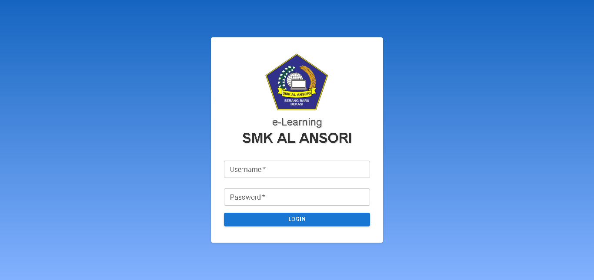

## Dashboard Admin

- Admin mengakses halaman daftar siswa
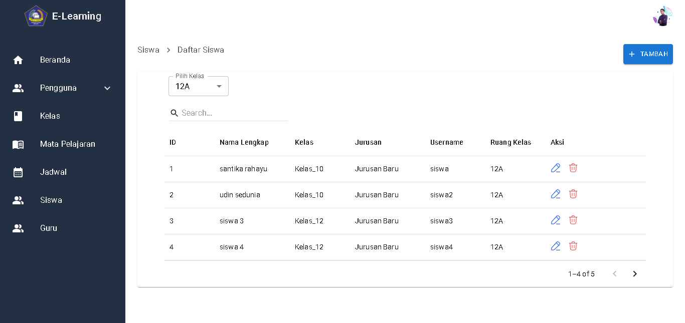

- Admin mengakses halaman update data kelas
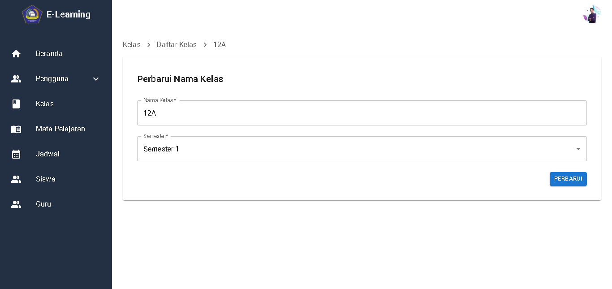

- Admin menambahkan data siswa baru
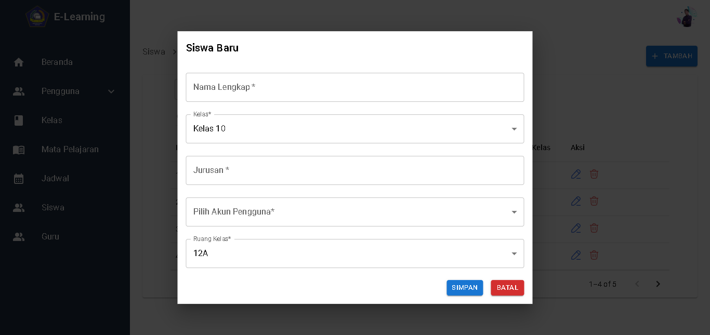

- Admin mengakses halaman profil
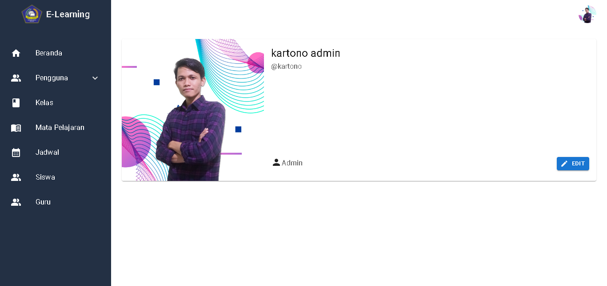

## Dashboard Guru

- Guru mengakses halaman daftar jadwal
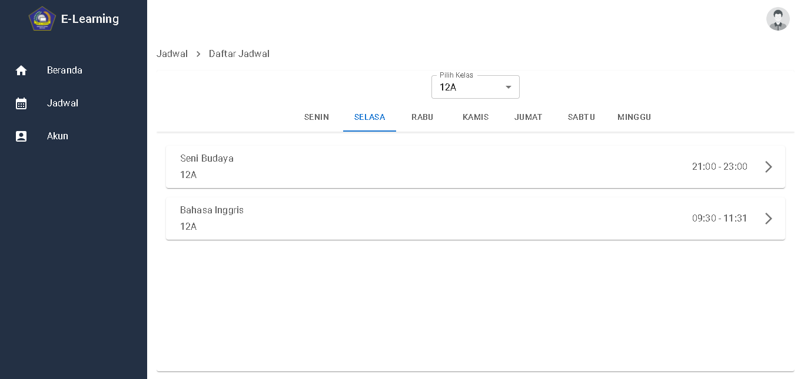

- Guru mengupload data materi belajar
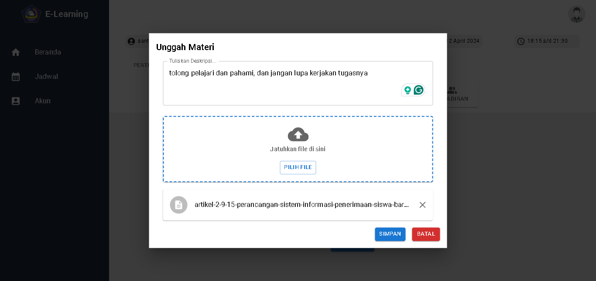

- Guru meelihat daftar kehadiran siswa
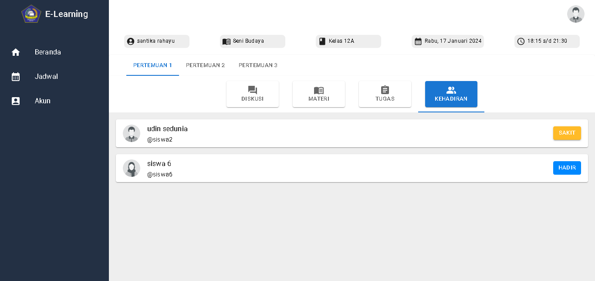

## Dashboard Siswa

- Siswa melihat dan membuat pesan diskusi
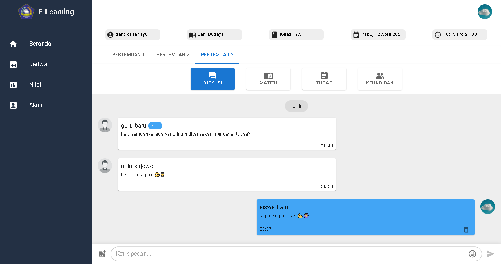

- Siswa mengakses materi belajar dan download
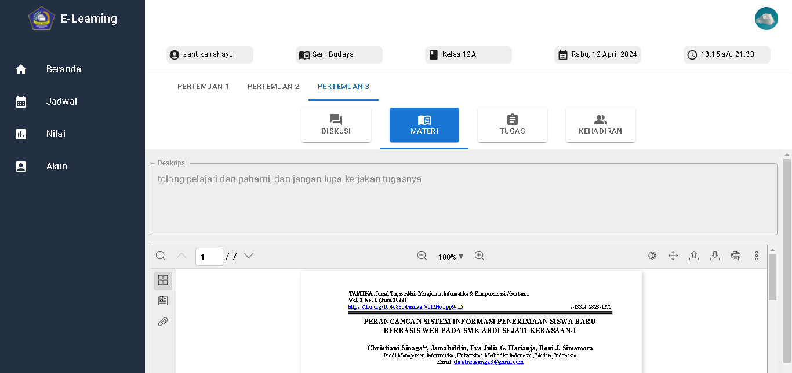

- Siswa melihat nilai
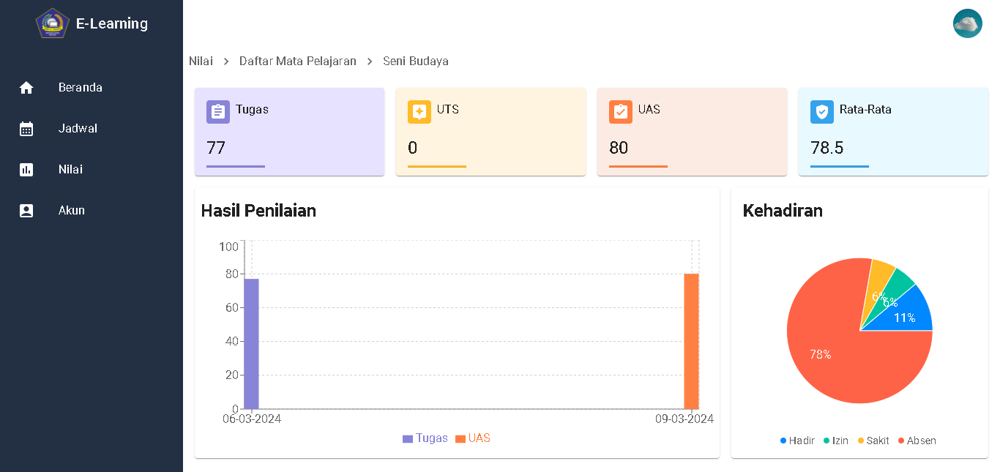

